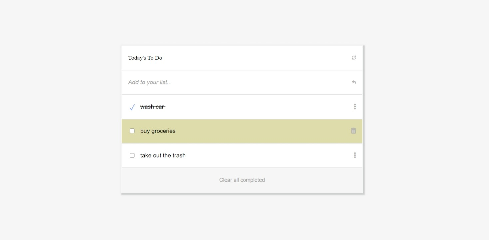

# To-Do List

> "TO DO LIST" is a simple website that displays a list of to do activities and allows you to add and remove activities from the list. In order to achieve this project i wrote some of function definitions using ES6 and webpack technology and applied html, css and JavaScript 

## Screenshots

## Live Demo

[Live Demo Link](https://rayhantabase.github.io/to-do-list/)

## Built With

- HTML, JavaScript(ES6), CSS
- Webpack
- Tools used - Git(version control), WebHint(linting tool), Stylelint(style linting), ESLint(Javascript linting)

## Authors

👤 **Salim Abdulai**

- GitHub: [@RayhanTabase](https://github.com/RayhanTabase)
- Twitter: [@RayhanTabase](https://twitter.com/@RayhanTabase)
- LinkedIn: [Salim-Abdulai](https://linkedin.com/in/salim-abdulai-5430065b)
- Email: salimabdulai2@yahoo.com

## 🤝 Contributing

Contributions, issues, and feature requests are welcome!

Feel free to check the [issues page](../../issues/).

## Show your support

Give a ⭐️ if you like this project!

## 📝 License

This project is [MIT](./MIT.md) licensed.

